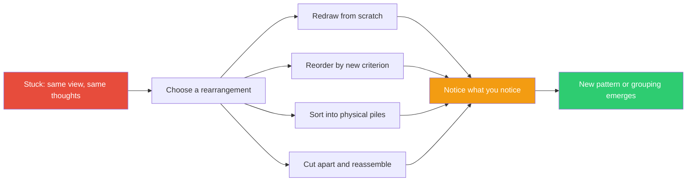

## The Move

Distinguish two kinds of action: PRAGMATIC actions change the world toward your goal; EPISTEMIC actions change what you can perceive. Right now, you do not need a pragmatic action — you need to see the problem differently. Stop analyzing and **rearrange** the elements of your problem. Redraw the diagram from scratch — don't copy the old one. Reorder the list — alphabetically, by size, by dependency, by fear. Sort index cards into piles using a criterion you haven't used before. Copy the code into a new file and reorder the functions. Print the architecture diagram and cut it into pieces with scissors. Kirsh and Maglio showed that Tetris experts rotate pieces not to place them but to **see** new possibilities. These are "epistemic actions" — actions that change what you can perceive, as opposed to pragmatic actions that change the world. You are not making progress — you are making the problem visible. Rearrange first, then notice what you notice.

## When to Use

- When you've been staring at the same representation for too long
- When you understand every individual component but can't see the whole
- When thinking harder produces diminishing returns
- When you need a fresh perspective but don't have another person available

## Diagram

## Example

**Situation:** You're debugging a distributed system failure. You have 14 log entries from 5 services, timestamped over 3 seconds. You've read through them chronologically four times. Nothing clicks.

**Rearrangement 1:** Sort log entries by *service* instead of time. Now you see that Service C has 6 of the 14 entries — suspiciously chatty. You hadn't noticed because they were interleaved.

**Rearrangement 2:** Copy the log entries onto sticky notes. Put them on a whiteboard arranged spatially — one column per service, time flowing downward. Draw arrows for every cross-service call. You immediately see a cycle: A calls B calls C calls A. Nobody noticed the circular dependency in the chronological log because the entries looked linear.

**Rearrangement 3:** Sort the entries by *what changed* (state transitions). Now you see that the same record was updated 4 times in 3 seconds by 3 different services. The race condition is visible because the rearrangement grouped mutations of the same entity.

You didn't learn anything new. You rearranged what you already had, and the new spatial structure made the pattern perceptible.

## Watch Out For

- The point is not to find the "right" arrangement. The point is that *any* new arrangement shows you something the old one hid. Try at least two rearrangements.
- Digital rearranging works but physical rearranging is often better. The act of writing, cutting, and moving engages spatial cognition that screen-reading doesn't.
- Don't fall into the trap of perfecting the rearrangement. This is a quick move — spend 5 minutes rearranging, not 30 minutes making a beautiful diagram.
- If nothing emerges after two rearrangements, the problem may not be perceptual. You may actually be missing information, not just missing a view of it.
