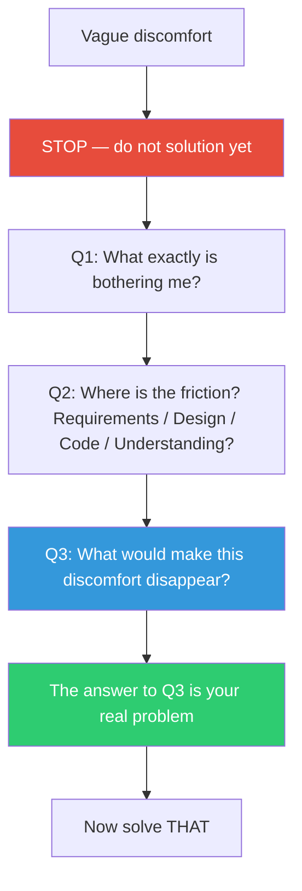

## The Move

Stop. Do not propose a solution, open an editor, or sketch an architecture. Instead, set a timer for **{{timeframe.1}}** (or 2 minutes if that duration doesn't make sense) and sit with the discomfort. Do not fix anything, do not dismiss the feeling, do not rationalize it away. Discomfort is diagnostic information — your processing has detected something that your conscious reasoning hasn't formulated yet. Rushing past it is like ignoring a compiler warning. Ask three questions in sequence: (1) "What exactly is bothering me?" Write one sentence. (2) "Where precisely is the friction — in the requirements, the design, the code, or my understanding?" Name the layer. (3) "What would I need to see or know for this discomfort to disappear?" Write that down. The answer to question three is your actual problem. It is often different from the problem you were handed.

## When to Use

- You feel uneasy about a task but can't say why
- You've started implementing but keep second-guessing yourself
- A solution "works" but something about it doesn't sit right
- You're in a meeting where everyone is proposing solutions and nobody has named the problem

## Diagram

## Example

**Situation:** You're assigned a ticket to add caching to a slow API endpoint. You open the code and feel uneasy. You almost start adding a Redis layer but pause.

**Q1 — What's bothering me?** "The endpoint isn't doing anything obviously expensive. A cache feels like a band-aid."

**Q2 — Where is the friction?** In the requirements. The ticket assumes the endpoint is slow because it lacks caching, but nobody profiled it.

**Q3 — What would make this disappear?** "Seeing a flame graph that shows where the time actually goes."

**The real problem:** You don't need a cache. You need a profile. You run one and discover the endpoint is making 47 sequential database calls due to an N+1 query. Fixing the query takes 20 minutes and eliminates the latency. The cache would have masked the bug and added operational complexity for nothing.

## Watch Out For

- This move is two minutes, not two hours. If the discomfort doesn't crystallize quickly, switch to TF-166 (Return to the Raw Situation) for a deeper investigation
- "Sit with it" does not mean "do nothing and hope clarity arrives." It means actively interrogating the feeling with the three questions. Passive waiting is not reflective thought
- Sometimes the felt difficulty is just anxiety or impostor syndrome, not a legitimate signal. If Q2 points to "my understanding," the move is to learn, not to redefine the problem
- Dewey's insight is that the felt difficulty is DATA — your pre-conscious processing has detected something your conscious reasoning hasn't formulated yet. Ignoring it is ignoring data
