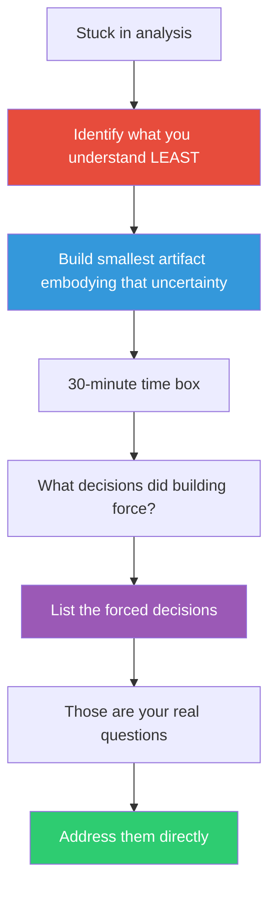

## The Move

Choose the thing you understand LEAST about the problem. Build the smallest possible artifact that embodies that specific uncertainty — a script, a diagram, a state machine, a throwaway function, a spreadsheet model. Build it in under 30 minutes. The artifact is not a prototype for others; it is a thinking tool for you. When you finish, ask: "What did building this force me to decide that I was previously avoiding?" Write down those forced decisions. They are the real questions your analysis was circling. As a lateral prompt: if {{word.1}} were a building material, what would you construct to represent this problem?

## When to Use

- You've been analyzing or discussing for more than an hour without progress
- You understand individual components but not how they interact
- The team keeps debating trade-offs abstractly with no resolution
- You need to discover what you don't know, not confirm what you do know

## Diagram

## Example

**Situation:** Your team is debating whether to use event sourcing or a traditional CRUD approach for an order management system. The debate has lasted three meetings. Everyone has opinions but nobody has certainty.

**What you understand least:** How event replay would actually work when an order has 15+ state transitions and some events need to be compensated.

**Build to think:** You write a 50-line Python script that models an order as a list of events: `OrderCreated`, `ItemAdded`, `ItemRemoved`, `PaymentReceived`, `Shipped`, `ReturnRequested`. You implement `replay(events)` to rebuild current state and `compensate(event)` to reverse an event.

**What building forced you to decide:**
1. Do compensating events delete the original, or append a negation? (You chose append — and realized this means your event store grows monotonically.)
2. What happens when you compensate `Shipped`? (You couldn't implement it — shipping is irreversible in the real world.)
3. How do you handle event ordering across services? (You hardcoded sequential IDs and realized you'd need distributed timestamps in production.)

**Result:** 30 minutes of building surfaced three concrete questions that three meetings of analysis had not. Question 2 alone ("some events are physically irreversible") killed the pure event-sourcing approach and led the team to a hybrid design.

## Watch Out For

- The artifact must be throwaway. If you start caring about code quality, variable names, or test coverage, you've shifted from thinking to building — and this move is about thinking through building
- 30 minutes is a hard cap. If the artifact isn't done, the INCOMPLETENESS is the lesson — it tells you the scope of what you don't understand
- This move assumes you've already spent time analyzing. If you haven't, building first is just hacking. The value is in the contrast between what you thought you understood and what building revealed
- Don't confuse this with prototyping. A prototype tests whether a solution works for users. Build-to-think tests whether YOU understand the problem
