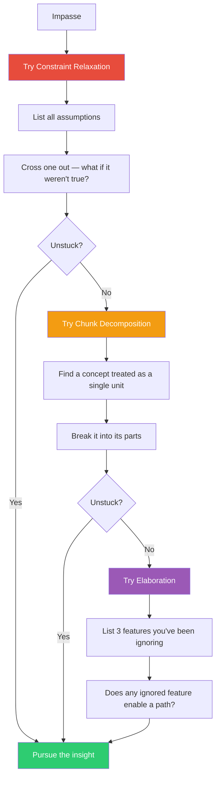

## The Move

Try representing the problem as {{genre.1}} — which of the three operations does the new representation unlock? You're at impasse — not because the problem is impossible, but because your mental representation blocks the path. Try three specific operations in order. (a) CONSTRAINT RELAXATION: List every assumption or rule you're following. Cross out one that seems mandatory and ask "what if this weren't true?" (b) CHUNK DECOMPOSITION: Find a concept you're treating as a single unit and break it into its parts. A "user" might be an account, a session, and a profile. A "request" might be a header, a body, and a context. (c) ELABORATION: List three features of the problem you've been ignoring because they seemed irrelevant. The solution often hides in what you dismissed.

## When to Use

- You hit the same wall no matter which approach you try
- The problem feels like it should be solvable but you can't see the path
- You've been staring at a piece of code or a design and the answer won't come
- Someone else solves it easily and you think "I should have seen that"

## Diagram

## Example

**Situation:** You need to implement a permissions system where users can share documents with "view" or "edit" access. But some documents are nested inside folders, and folder permissions should cascade to documents within — except when a document has an explicit override. Every approach creates either a recursive query nightmare or a stale-cache problem.

**(a) Constraint relaxation:** You've been assuming permissions must be checked in real-time at query time. What if they weren't? What if permissions were pre-computed and materialized on every change? That eliminates the recursive query at read time.

**(b) Chunk decomposition:** You've been treating "permission" as one thing. Break it: an *effective permission* is the union of *explicit grants*, *inherited grants*, and *explicit overrides*. Now each is a separate, simpler data structure.

**(c) Elaboration:** You've been ignoring the fact that folder structures rarely change — users reorganize maybe once a month. That means the "cascade recalculation on structural change" cost is negligible because it almost never happens. This ignored feature makes the pre-computation approach viable: rare recalculation + instant reads.

**Result:** The solution was visible once you (a) relaxed "must be real-time," (b) decomposed "permission" into three parts, and (c) noticed that structural changes are rare. Same problem, different representation, obvious solution.

## Watch Out For

- Constraint relaxation is the most powerful but also the most dangerous. Make sure the constraint you dropped was actually an assumption, not a hard requirement. "Users must authenticate" is not a constraint to relax
- Chunk decomposition requires domain knowledge. You can only decompose a concept into parts if you know what the parts are. If you can't decompose, you may need to learn more before this move helps
- Elaboration often surfaces "environmental" features — things about usage patterns, timing, or frequency — that your abstract model ignored. These are often the key to practical solutions
- If all three operations fail, the impasse may not be representational. You might be missing knowledge, not a different view. Try TF-167 (Build to Think) or TF-068 (Incubation Timer) instead
