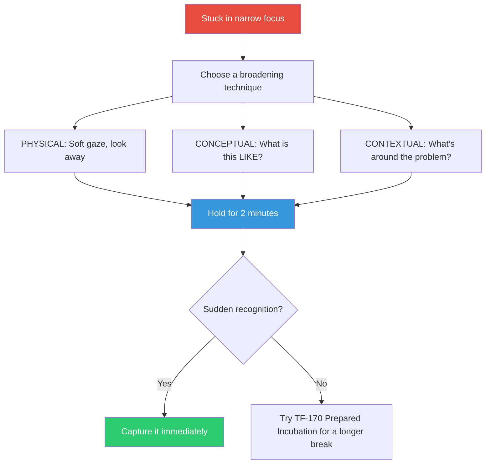

## The Move

Consciously shift from narrow, analytical focus to broad, associative attention. Three concrete ways: (1) DIVERSIFY: Increase the variety of approaches you're considering. If you've been trying variations of the same strategy, deliberately try something from a completely different category. Relax the constraints you've been holding as fixed and see what opens up. (2) CONCEPTUAL: Instead of asking "how do I solve X?" ask "what is this problem LIKE? What does it remind me of?" Let associations surface without judging them. (3) CONTEXTUAL: Zoom out from the specific failure to the surrounding system. What is happening around the problem, not in it? What adjacent factors have you been ignoring? Spend two minutes in this broadened state. The insight, if it comes, will arrive as a sudden recognition — not a chain of reasoning.

## When to Use

- You've been in intense analytical focus for more than 30 minutes without breakthrough
- You need creative insight, not more logical deduction
- The answer feels like it's on the tip of your tongue but won't crystallize
- You're grinding through possibilities one by one and none of them work

## Diagram

## Example

**Situation:** You're debugging a race condition in a distributed lock. Two services occasionally acquire the same lock. You've been tracing logs line by line for an hour, comparing timestamps, and you can't find the window where both hold the lock.

**Broaden physically:** You push back from the desk and look out the window for a minute.

**Broaden conceptually:** Instead of "where's the race condition?" you ask "what is this LIKE?" It's like... two people trying to sit in the same chair. They both check "is the chair empty?" and both see "yes" before either sits down.

**Broaden contextually:** You stop looking at the lock code and look at what's AROUND it. The health check. The load balancer. The DNS TTL. Wait — the services use a Redis lock with a 30-second TTL, and the health check sometimes causes a GC pause longer than 30 seconds. The lock expires during the pause. Service B acquires it legitimately. Service A resumes after GC, still believing it holds the lock.

**Result:** Zooming out from the lock code to the surrounding infrastructure revealed the actual cause — a GC pause exceeding the TTL. Line-by-line analysis of the lock code would never have found it because the lock code is correct. The bug is in the relationship between the lock and its environment.

## Watch Out For

- This is not "stare into space and hope." The attentional shift is deliberate and should be held for a defined duration (2 minutes). If nothing surfaces, switch to a more structured move
- Kounios and Beeman's research shows that broadened attention facilitates insight but does not guarantee it. Treat it as increasing the probability, not as a reliable mechanism
- Know when you need insight vs. analysis. If the problem is one of careful deduction (find the off-by-one error), narrowed focus is correct. If the problem requires seeing a pattern or making a connection, broadened attention is correct. Choose the right attentional state for the task
- Do not use this in a meeting or pair-programming session — it looks like zoning out. Use TF-168 (Representational Change) for a structured equivalent that works in social settings
