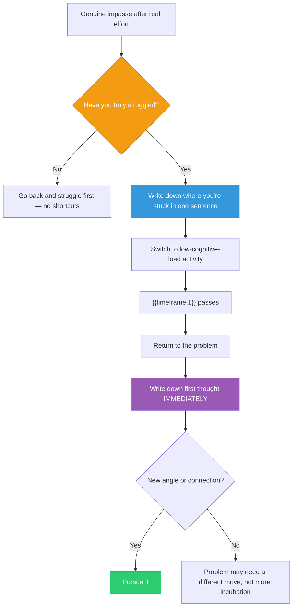

## The Move

This move has two non-negotiable prerequisites — skip either and it fails. (1) PREPARATION: You must have genuinely struggled. Spent real time. Tried multiple approaches. Hit actual dead ends. Loaded the problem deeply. If you haven't done this, go back and do it — incubation without preparation produces nothing. (2) RELEASE: Once you've truly hit the wall, context-switch to a completely different problem or domain for **{{timeframe.1}}** (use 20 minutes if that duration is impractical). The switch must be genuine: a different project, a different kind of task, an unrelated problem with different constraints. The goal is to load entirely different patterns while the original problem continues to process in the background. When the time is up, return to the problem and write down whatever comes to mind first — before your analytical filter engages.

## When to Use

- You've spent significant focused time (30+ minutes) and hit a genuine impasse
- You've tried multiple approaches and all have failed for understood reasons
- You can feel that the problem is loaded deeply into your mind but the answer won't come
- Continued grinding is producing diminishing returns or circular thinking

## Diagram

## Example

**Situation:** You're designing a notification system that must support per-user preferences (email, push, in-app), per-channel rate limits, and cross-channel deduplication. You've spent two hours trying architectures: a single pipeline with branching (too complex to rate-limit per channel), separate per-channel pipelines (can't deduplicate across them), a central orchestrator (single point of failure). Every approach solves two requirements and breaks the third.

**Preparation check:** Yes — you've tried three distinct architectures, understood why each fails, and can articulate the exact three-way tension.

**Write it down:** "Need per-user routing, per-channel rate limiting, and cross-channel dedup — every architecture solves two and breaks the third."

**Release:** You go for a walk for {{timeframe.1}}. On the walk, you're idly thinking about how your mail carrier handles packages — some go to the front door, some to the locker, and there's a shared tracking number across all delivery methods.

**Return and first thought:** "What if dedup happens BEFORE routing, not after? A dedup layer assigns a notification ID, checks if that ID was already handled, and only THEN routes to channels. Each channel pipeline handles its own rate limiting independently. Dedup is decoupled from routing is decoupled from rate limiting."

**Result:** The insight was to change the ORDER of operations — dedup first, then route, then rate-limit — rather than trying to do all three simultaneously. The three-way tension dissolves because each concern operates at a different stage.

## Watch Out For

- The most common failure is skipping preparation. Taking a walk after 5 minutes of shallow thinking is not incubation — it's procrastination. You must have genuinely loaded the problem
- The second most common failure is choosing a break activity with too much cognitive load (reading technical articles, scrolling social media with complex content). The activity should occupy your surface attention, not your deep processing
- Incubation does not always produce insight. If nothing surfaces after one cycle, do not repeat indefinitely. Try a structured move like TF-168 (Representational Change) instead
- Write down the first thought before filtering it. The analytical mind will immediately say "that won't work because..." Capture the raw insight first, evaluate second. Fragile ideas die under premature scrutiny
