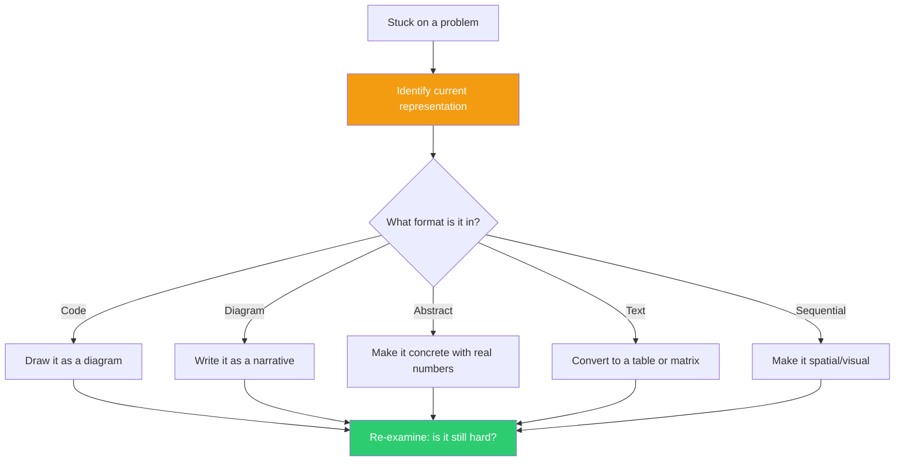

## The Move

Shift to the native format of {{genre.1}}. Simon and Newell showed that choosing the right REPRESENTATION often matters more than clever problem-solving within a bad representation. The famous Mutilated Checkerboard problem is nearly impossible when represented as a tiling problem and trivial when represented as a coloring problem. You are stuck — but the problem may not be hard. Your REPRESENTATION may be making it hard. Rewrite the problem in a completely different format: if it is code, draw it as a diagram. If it is a diagram, write it as a narrative. If it is abstract, make it concrete with specific numbers. If it is a wall of text, make it a table. The same problem in a new representation may be trivially easy.

## When to Use

- You have been staring at the same representation for too long without progress
- The problem feels impossibly complex but you suspect it should not be
- You understand each piece individually but cannot see the whole
- Explaining the problem in a different medium (whiteboard, conversation) makes it suddenly clearer

## Diagram



## Example

**Problem:** A developer is debugging a race condition in an order processing system. Three services (Payment, Inventory, Notification) communicate via events. Orders occasionally end up in an inconsistent state — payment charged but inventory not decremented. The developer has been reading event handler code across three repositories for two hours, tracing execution paths in their head.

**Current representation:** Code (sequential text across three repos).

**Representation shift — sequence diagram:**

```
Payment Service          Inventory Service         Notification Service
     |                         |                         |
     |--- PaymentCharged --->  |                         |
     |                         |--- InventoryReserved --> |
     |                         |                         |--- NotifyUser
     |                         |                         |
     |  (What if this fails?)  |                         |
     |                         |<-- timeout, no ack --   |
     |                         |--- InventoryReleased    |
     |                         |                         |
     |  (But payment already   |                         |
     |   charged!)             |                         |
```

**What the new representation reveals:** The race condition is immediately visible in the sequence diagram: the Inventory Service releases inventory on timeout, but the Payment Service has already charged. In code, this required tracing through three repos and mentally simulating asynchronous timing. In the diagram, the gap between the PaymentCharged event and the InventoryReleased event is visually obvious. The fix is also obvious in this representation: the Payment Service needs to listen for InventoryReleased events and issue a refund. In the code representation, this missing handler was invisible because you cannot see what is NOT there.

## Watch Out For

- Representation shifts take effort. You must actually DO the conversion, not just think "I could draw this." The insight comes from the act of translating, which forces you to re-examine every element
- Some representations lose information. A diagram of code drops the details. A narrative of a diagram drops the spatial relationships. Be aware of what each format hides as well as what it reveals
- If the first shift does not help, try a second. The goal is not any specific format — it is breaking out of the representation that has you stuck
- Do not confuse this with "just think about it differently." This move requires a concrete, physical change in format — on paper, on screen, on a whiteboard. The new medium constrains your thinking in productive ways
