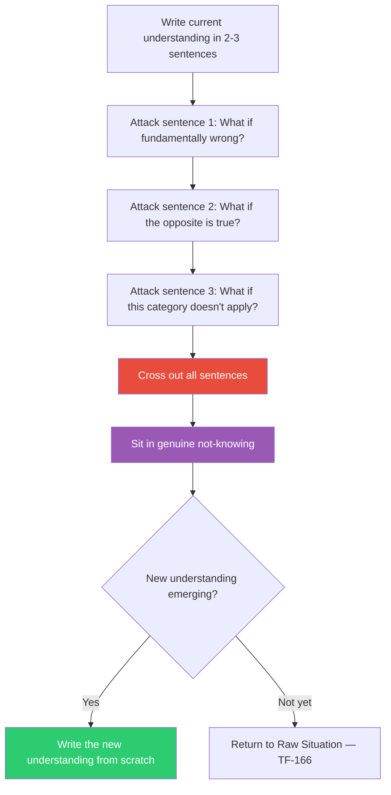

## The Move

Write down your current understanding of the problem in 2-3 sentences. Now attack each sentence — not to improve it, but to dismantle it. For each sentence ask: "What if this is not slightly off but fundamentally wrong? What if the opposite is true? What if this category does not even apply?" Cross out each sentence as you demolish it. The goal is to reach genuine not-knowing — a cleared space where a completely new understanding can form. Hold {{koan.1}} in the back of your mind while you do this; it keeps you in productive confusion rather than rushing to rebuild. Do not reconstruct until the ground is fully cleared.

## When to Use

- You have reframed the problem multiple times and every reframe feels like rearranging deck chairs
- Your mental model is internally consistent but keeps failing against reality
- You notice yourself defending your understanding rather than questioning it
- You feel like you are "too deep in" to start over, but nothing is working

## Diagram

## Example

**Situation:** You are building a real-time collaborative editor. For two weeks your understanding has been: "The core problem is conflict resolution between concurrent edits. We need a better CRDT." You have evaluated five CRDT libraries. None feel right. Progress has stalled.

**Problematize:**

1. *"The core problem is conflict resolution."* — What if it is not? What if conflicts are actually rare in your use case and the core problem is latency perception? Cross it out.
2. *"Concurrent edits need a CRDT."* — What if they do not? What if your users never actually edit the same paragraph at the same time and a simple last-write-wins with undo history would suffice? Cross it out.
3. *"We need a better CRDT."* — What if no CRDT will help because the real issue is that your document model is wrong — you are treating it as a flat text buffer when users think in blocks? Cross it out.

**Cleared ground:** You no longer "know" what the problem is. You go back to the raw situation (TF-166): watch three users actually collaborate. You notice they rarely have conflicts — but they constantly wait for saves. The problem was never conflict resolution. It was perceived responsiveness. A completely different architecture (optimistic local-first rendering) solves it without any CRDT at all.

## Watch Out For

- This move is violent by design. Do not soften it into "gentle reframing." The point is to actually demolish, not adjust
- You will feel uncomfortable in the not-knowing state. That discomfort is the signal it is working. Do not rush to rebuild
- Problematization is not nihilism — you destroy the old understanding IN ORDER to build a better one. If you stay in destruction mode permanently, pair with TF-166 to re-anchor in concrete reality
- Do not use this move on well-validated understandings that are working. It is for situations where your framework has repeatedly failed
